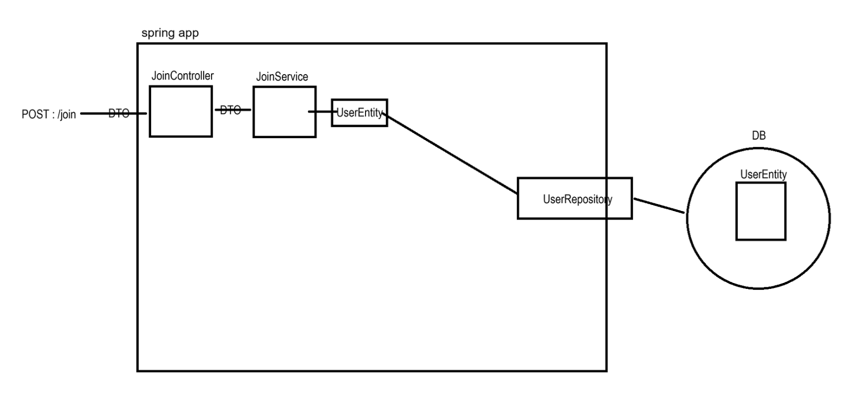
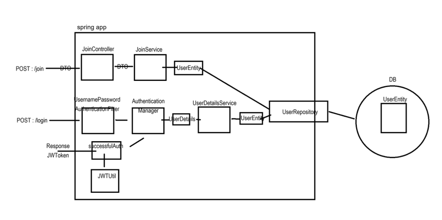
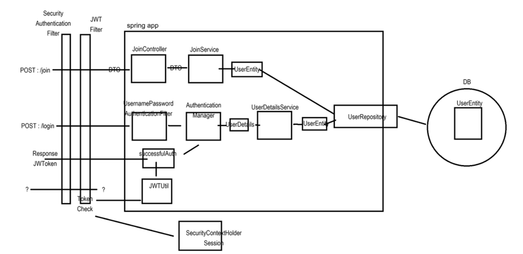

# 구현 목표
스프링부트 + 스프링 시큐리티를 활용하여 JWT 방식으로 인증/인가 즉 로그인을 구현하며 
회원정보 저장(영속성)은 MySQL 데이터베이스를 활용하여 구현한다. 

Front 단은 없고 Rest API 를 만들어서 사용한다  

## 구현
- 인증: 로그인
- 인가: jwt를 사용하여 경로별 접근 권한
- 회원가입

## 프로젝트 버전
- SpringBoot 3.3.1
- JDK 17
- Spring Security 6.3
- Spring Data JPA
- MySQL
- Thymeleaf
- Intellij Ultimate

## JWT 인증 방식 시큐리티 동작 원리
회원가입은 기존 세션 방식과 JWT 방식에서 큰 차이는 없다  
  

### 로그인 (인증)
로그인 요청을 받은 후 세션 방식은 서버 세션이 유저 정보를 저장하지만 JWT 방식은 토큰을 생성하여 응답한다.  
  

### 경로 접근 (인가) 
JWT Filter를 통해 요청의 헤더에서 JWT를 찾아 검증을하고 일시적 요청에 대한 Session을 생성한다. (생성된 세션은 요청이 끝나면 소멸됨)  
  
1) SecurityAuthentication Filter 를 통한 1차 검증
2) JWT Filter 를 통한 2차 검증
-> 토큰이 알맞게 존재하면, 일시적인 세션을 생성해서 특정한 경로를 들어갈 수 있다  

### Reference
https://www.youtube.com/watch?v=NPRh2v7PTZg&list=PLJkjrxxiBSFCcOjy0AAVGNtIa08VLk1EJ