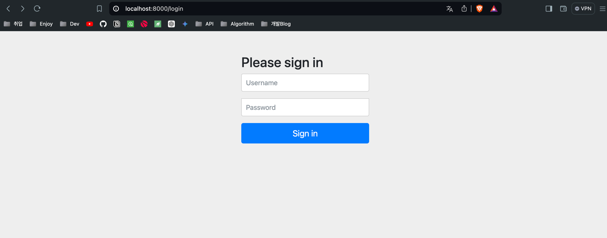
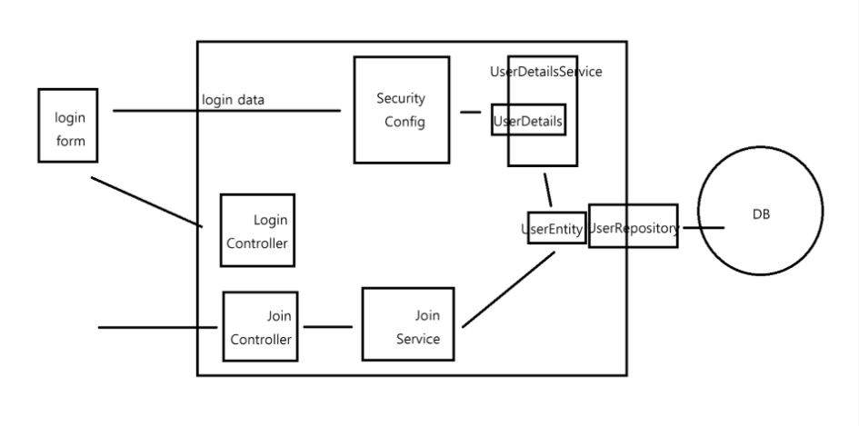
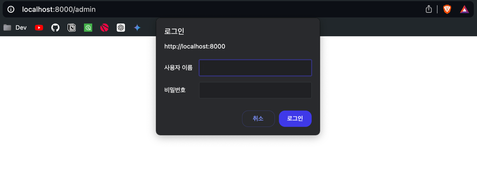

# 구현 목표
스프링 시큐리티 프레임워크를 활용하여 인증/인가를 구현하고 회원정보 저장(영속성) <br>
은 MySQL 데이터베이스를 활용하여 구현한다.

## 구현
- 인증: 로그인
- 인가: 경로별 접근 권한
- 회원가입

### 프로젝트 버전
- SpringBoot 3.3.1
- JDK 21
- Spring Security 6.1.5
- Spring Data JPA - MySQL
- Thymeleaf
- Intellij Ultimate

## 스프링 시큐리티 동작원리
스프링부트 어플리케이션은 서블릿 컨테이너 위에서 동작한다 <br>
스프링 시큐리티에서 Filter 라는 클래스를 만들어 조작을 하면 <br>
어플리케이션 실행 시, 미리 만들어둔 스프링 시큐리티 Filter 가 클라이언트 요청을 가로챈다 <br>

클라이언트가 가려 하는 목적지 이전에 클라이언트가 권한이 있는지 체크를 한다 <br>

### Spring Security Basic
처음에 프로젝트 실행을 시키면<br>
<br>
화면이 나타난다 <br>

위 화면을 통과하는 원초적인 방법은 <br>
Id : user <br>
Password : 서버 실행시 기본적으로 주는 password <br>
를 입력하면 로그인이 되고, 로그인이 완료되면 실행할 URL 로 넘어갑니다 <br>

현재는 Security 에 Config 를 하지 않았기 때문에 모든 경로에 대해서 Security 가 적용이 된다 <br>

Client 가 스프링 서버에 요청을 날리면, 서블릿 컨테이너를 통과해서 스프링 어플리케이션으로 온다 <br>
서블릿 컨테이너는 여러 필터를 가지고 있는데, 스프링 시큐리티 설정에서 Filter 를 추가하면 <br>
서블릿 컨테이너 단에 필터 하나가 생겨, 그 필터에서 요청을 가로챈다 <br>

필터는 클라이언트가 특정한 경로로 가는데 그 User 는 접근 권한이 있는지, 로그인이 되어있는지, 특정 Role 이 있는지 검증을 한다. <br>

### 인가?
특정한 경로에 요청이 오면 Controller 클래스에 도달하기 전 필터에서 Spring Security 가 검증을 함 <br>
위 필터는 Spring 어플리케이션 내부 필터가 아닌, 서블릿 컨테이너(=톰캣) 컨테이너에서 검증을 하는 것이다 <br>

#### 그럼 어떠한 검증을 하나?
- 현재 요청 한 사람이 접근 권한이 있는지
- 현재 요청한 사람이 로그인이 되어 있는지
- 현재 요청한 사람이 특정 Role 이 있는지

다양한 검증이 있지만, 대표적으로 위 3가지 검증을 많이 진행합니다

처음에 시큐리티 를 DI 하고 서버를 실행시키면 로그인 창이 뜨는 이유도 알 수 있다 <br>
스프링 시큐리티가 아직 로그인이 안된 사용자라는걸 알고 로그인을 하라고 로그인 창으로 보내버리는 것이다 <br>

이제 Config 작업을 해보자 <br>

```java
@Configuration // 이 클래스는 스프링 부트 한테 Config 클래스로 등록이 된다.
@EnableWebSecurity // 스프링 시큐리티 한테도 관리를 받게 하기 위함.
public class SecurityConfig {

	@Bean
	public SecurityFilterChain filterChain(HttpSecurity http) throws Exception {

		http
			// 특정 경로에 요청을 허용하거나 거부하거나 할 수 있게 한다.
			.authorizeHttpRequests( (auth) -> auth
				.requestMatchers("/", "/login").permitAll() // "/" 및 "/login" 은 모든 사람 접근 가능하게 함
				.requestMatchers("/admin").hasRole("ADMIN")  // "/admin" 관리자 페이지는 Role 이 ADMIN 인 사람만 접근 가능하게 함.
				.requestMatchers("/mypage/**").hasAnyRole("USER", "ADMIN") // ** 는 {id} 같은거 의미, hasAnyRole 은 여러 역할 처리함
				.anyRequest().authenticated() // anyRequest 는 나머지 처리 경로를 다 처리하게 한다.
			);
			// 특정한 경로에 특정 작업을 진행하고 싶다.

		return http.build();
	}

}
```

- permitAll() 모든 사용자 경로 허용
- hasRole 특정 ROLE 이 있어야 경로에 접근 가능
- authenticated() : 로그인만 진행하면 모든 접근 가능하게 한다.
- denyAll() : 모든 접근 거부
- requestMatchers : 1개의 요청을 처리하는 것.
- anyRequest() : 여러개 요청을 처리하는 것.

위 로직은 상단에서 부터 아래로 코드가 실행 되기 때문에 <br>
실행 순서에 유의 해야 한다 <br>

그리고 가장 아래에서 anyRequest() 메소드를 통해 나머지 URL 에 대한 요청을 컨트롤 해야한다 <br>

스프링부트 3.1 부터 사용하는 이전 버전 스프링 시큐리티 메소드 들 구현을 메소드 체이닝을 선호하다가 <br>
현재는 함수형 방식으로 메소드를 만들어야 한다 <br>

즉 모든 메소드를 필수적으로 람다형으로 구현해야 한다 <br>

### Custom Login
```html
<!DOCTYPE html>
<html xmlns:th="http://www.thymeleaf.org">
<head>
    <meta charset="UTF-8">
    <title>Login</title>
</head>
<body>
<h2>Login Page</h2>
<form action="/loginproc" method="post" name="loginform">
    <input id="username" type="text" name="username" placeholder="ID" /> <br><br>
    <input id="password" type="password" name="password" placeholder="Password" /> <br><br>
    <button type="submit">로그인</button>
</form>

</body>
</html>
```

```java
		http
			.formLogin((auth) -> auth
				.loginPage("/login") // 우리가 Custom 한 로그인 페이지 경로를 적는다, 자동으로 redirection 을 해준다.
				.loginProcessingUrl("/loginProc") // html 로그인 id,password 를 특정한 경로로 보낸다 -> Post 방식임.
				.permitAll()
			);

		// CSRF 설정, Post 요청시 csrf 토큰도 보내줘야 로그인이 됨.
		http
			.csrf((auth) -> auth.disable()
			);
```

위 코드를 Config 에 추가해주면 로그인 폼과, 로그인시 Post 요청을 사용할 수 있다 <br>
위 변조 토큰인 csrf 란 토큰이 있다 <br>

### Bcrypt 암호화
시큐리티 암호화를 무조건 진행해야 한다 <br>
사용자가 로그인시 스프링 시큐리티에 의해 검증이 된다 <br>
비밀번호는 단방향 알고리즘을 이용해 암호화를 한다 <br>
회원가입시 비밀번호를 해쉬 를 통해 암호화하고, 로그인시 해쉬를 통해 복호화를 해야한다 <Br>

그래서 시큐리티 BCryptPasswordEncoder 를 제공한다 <br>
```java
	@Bean
	public BCryptPasswordEncoder passwordEncoder() {
		return new BCryptPasswordEncoder();
	}
```

위 메소드를 Bean 으로 등록하면 스프링 컨텍스트에 passwordEncoder 라는 인스턴스가 저장이 된다 <br>

## DB 기반 인증 로직
<br>
```java
public interface MemberEntityRepository extends JpaRepository<MemberEntity, Long> {
	boolean existByUsername(String username);

	MemberEntity findByUsername(String username);
}

```
```java
@RequiredArgsConstructor
@Service
public class RegisterService {
	private final MemberEntityRepository memberEntityRepository;
	private final BCryptPasswordEncoder bCryptPasswordEncoder;

	public void register(MemberDTO memberDTO) {

		boolean isUser = memberEntityRepository.existByUsername(memberDTO.getUsername());
		if(isUser) {
			throw new RuntimeException("이미 존재하는 회원 입니다.");
		}

		MemberEntity member = new MemberEntity();
		member.setUsername(memberDTO.getUsername());
		member.setPassword(bCryptPasswordEncoder.encode(memberDTO.getPassword()));
		member.setRole(Role.ADMIN);

		memberEntityRepository.save(member);
	}
}

```
```java
@RequiredArgsConstructor
@Service
public class CustomUserDetailService implements UserDetailsService {
	private final MemberEntityRepository memberEntityRepository;

	@Override
	public UserDetails loadUserByUsername (String username) throws UsernameNotFoundException {

		MemberEntity byUsername = memberEntityRepository.findByUsername(username);

		if(byUsername != null) {
			return new CustomUserDetails(byUsername);
		}

		return null;
	}

}
```
```java
public class CustomUserDetails implements UserDetails {

	/*
	* 로그인 검증을 처리하는 로직이다.
	* */

	private final MemberEntity memberEntity;

	public CustomUserDetails (MemberEntity memberEntity) {
		this.memberEntity = memberEntity;
	}

	@Override
	public Collection<? extends GrantedAuthority> getAuthorities () {
		Collection<GrantedAuthority> collection = new ArrayList<>();

		collection.add(new GrantedAuthority() {
			@Override
			public String getAuthority () {
				System.out.println(memberEntity.getRole());
				return memberEntity.getRole().getDescription();
			}
		});

		return collection;
	}

	@Override
	public String getPassword () {
		return memberEntity.getPassword();
	}

	@Override
	public String getUsername () {
		return memberEntity.getUsername();
	}

	// 아래 4가지 메소드는 회원가입시 Role 을 하나를 더 줘야 한다.
	// 만약 이 부분을 검증하는 로직을 처리하려면 DB 테이블에 아래 값들을 체크하는 필드(=컬럼)이 존재 해야 한다.
	@Override
	public boolean isAccountNonExpired () {
		return UserDetails.super.isAccountNonExpired();
	}

	@Override
	public boolean isAccountNonLocked () {
		return UserDetails.super.isAccountNonLocked();
	}

	@Override
	public boolean isCredentialsNonExpired () {
		return UserDetails.super.isCredentialsNonExpired();
	}

	@Override
	public boolean isEnabled () {
		return UserDetails.super.isEnabled();
	}

}

```

위처럼 로직을 짜면 로그인 후 검증을 처리할 수 있다 <br>

참고로 스프링 시큐리티에서 hasRole 메소드, hasAnyRole() 메소드를 사용하면 <br>
자동으로 접두사 ROLE_ 을 붙여주니 참고해야 한다 <br>

## 로그인된 사용자 아이디 정보 얻는 방법
```java
	@GetMapping("/")
	public String root(Model model) {

		String id = SecurityContextHolder.getContext().getAuthentication().getName();

		Authentication authentication = SecurityContextHolder.getContext().getAuthentication();

		Collection<? extends GrantedAuthority> authorities = authentication.getAuthorities();
		Iterator<? extends GrantedAuthority> iter = authorities.iterator();
		GrantedAuthority auth = iter.next();

		String role = auth.getAuthority();

		model.addAttribute("id",id);
		model.addAttribute("role",role);
		return "main";
	}
```

## 세션 설정(소멸,중복 로그인, 고정 보호)
### 로그인 정보
사용자가 로그인을 진행한 뒤 사용자 정보는 SecurityContextHolder 에 의해서 서버 세션에 관리 된다 <br>
이때 세션에 관해 세션의 소멸 시간, 아이디당 세션 생성 개수를 설정하는 방법을 알아보자 <br>

### 세션 소멸 시간 설정
```yml
server:
  servlet:
    session:
      timeout: 60m
```
```java
		// 세션 관리 설정
		http
			.sessionManagement((auth) -> auth
				.maximumSessions(2) // 하나의 아이디에 대한 다중 로그인 허용 개수, 로그인이 되있는 상태에서 2개 기기에 더 로그인할 수 있다.
				.maxSessionsPreventsLogin(true) // true: 초과시 새로운 로그인 차단, false : 초과시 기존 세션 하나 삭제
			);
```

### 세션 고정 보호
해킹으로부터 세션, 쿠키를 보호한다 <br>
세션 고정 공격을 보호하기 위한 로그인 성공시 세션 설정 방법은 sessionManagement() 메소드의 sessionFixation() 메소드를 통해 설정한다 <br>
```java
		// 세션 보호 설정
		http
			.sessionManagement((auth) -> auth
				.sessionFixation().none() // 로그인 시 세션 정보 변경 안함
				.sessionFixation().newSession() // 로그인 시 세션 새로 생성
				.sessionFixation().changeSessionId() /// 로그인 시 동일한 세션에 대한 id 변경
			);
```

### CSRF 설정
csrf? 요청을 위조하여 사용자가 원하지 않아도 서버측으로 특정 요청을 강제로 보내는 방식<br>
게시글에 crud 를 할 때 api 에 http 요청을 몰래 심어서 공격하는 것이다 <br>
ex) 회원 정보 변경, crud 를 사용자 모르게 요청 하는 공격 <br>


#### CSRF 방지 방식
security config 클래스에서 csrf.disable() 설정을 진행하지 않으면 자동으로 enable 설정이 된다 <br>
enable 설정시 스프링 시큐리티는 CsrfFilter 를 통해 post,put,delete 요청에 대해 토큰 검증을 진행한다 (조회는 노상관) <br>

즉 위 csrf 설정이 없으면 CUD 기능이 진행이 되지 않는다 <br>

그렇다면 form 에서 csrf 토큰을 서버측으로 보내줘야지 서버측에서 검증을 통해 cud 기능을 진행할 수 있다 <br>

POST 요청시 <br>
```html
<form action="/loginProc" method="post" name="loginform">
    <H2>로그인 폼</H2>
    <hr>
    <input id="username" type="text" name="username" placeholder="ID" /> <br><br>
    <input id="password" type="password" name="password" placeholder="Password" /> <br><br>
    <input type="hidden" name="csrf" th:value="${_csrf.token}" />
    <button type="submit">로그인 </button>
</form>
```

위 처럼 csrf 토큰을 요청시 심어줘야 한다 <br>
AJAX 요청도 같다 <br>

하지만 보통 API 서버의 경우 보통 세션을 Stateless 로 관리하기 때문에 스프링 시큐리티 csrf.enable 설정을 진행하지 않아도 된다. <br>
api 서버는 보통 세션을 stateless 인 jwt 로 관리하므로 csrf.enable() 을 설정할 필요 없다. <br>

### InMemory 방식 유저 정보 저장
1) DB 를 인메모리로 사용하는 경우(=Redis)
2) 소수 유저를 저장할 때 -> InMemoryUserDetailsManager

지금 방식은 2번 방법을 사용해보겠습니다 <br>
```java
	// 인메모리 방식 User 저장 -> 유저 각각의 넣어줘야 한다.
	// DB 를 연결하지 않아도, 서버 실행시 자동으로 메모리에 올라가 있는다.
	@Bean
	public UserDetailsService userDetailsService() {
		UserDetails user1 = User.builder()
			.username("user1")
			.password(passwordEncoder().encode("1234"))
			.roles("ADMIN")
			.build();

		UserDetails user2 = User.builder()
			.username("user2")
			.password(passwordEncoder().encode("1234"))
			.roles("ADMIN")
			.build();

		return new InMemoryUserDetailsManager(user1,user2);
	}
```

극 소수일때, 토이 프로젝트 일 때만 하는걸 추천하는 방식이다 <br>

### http Basic 방식 로그인
#### 스프링 시큐리티를 활용한 로그인 방식
1) 폼 로그인 방식 
- 로그인 페이지를 만들고 form 태그를 활용한 방법
2) http basic 방식 
- 아이디와 비밀번호를 Base64 방식으로 인코딩한 뒤 HTTP 인증 헤더에 부착하여 서버측으로 요청을 보내는 방식이다.
- 특정 페이지가 필요하지 않아, 브라우저에서 헤더에다가 아이디 비밀번호를 넣어서 하는 방식이다.
  - MSA 아키텍쳐에서 자주 사용한다.

HTTP Basic 인증 방식
```java
		// http basic 방식 로그인
		http
			.httpBasic(Customizer.withDefaults()
			);
```

 <br>
form 방식이 아닌 창이 하나 떠서 로그인 인증을 진행하게 된다 <br>


### 계층권한 : Role Hierarchy
계층 권한에 대하여 알아보자 <br>

권한A, 권한B, 권한C 가 존재하고 권한의 계층은 A<B<C 라고 설정을 진행하고 싶은 경우 Hierarchy 를 설정을 진행할 수 있다 <br>
```java
	// Hierarchy 설정
	@Bean
	public RoleHierarchy roleHierarchy() {
		return RoleHierarchyImpl.fromHierarchy(
			"ROLE_C > ROLE_B > \n" + "ROLE_B > ROLE_A");
	}
```

위 설정을 해두고 SecurityFilterChain 에서 다시 설정을 해줘야 한다 <br>
```java
		http
            .authorizeHttpRequests((auth) -> auth
	            .requestMatchers("/").hasAnyRole("A","B","C")
				.requestMatchers("/manage").hasAnyRole("B","C")
				.requestMatchers("/master").hasRole("C")
```

## 참조
개발자 유미님 : https://www.youtube.com/watch?v=NdRVhOccuOs